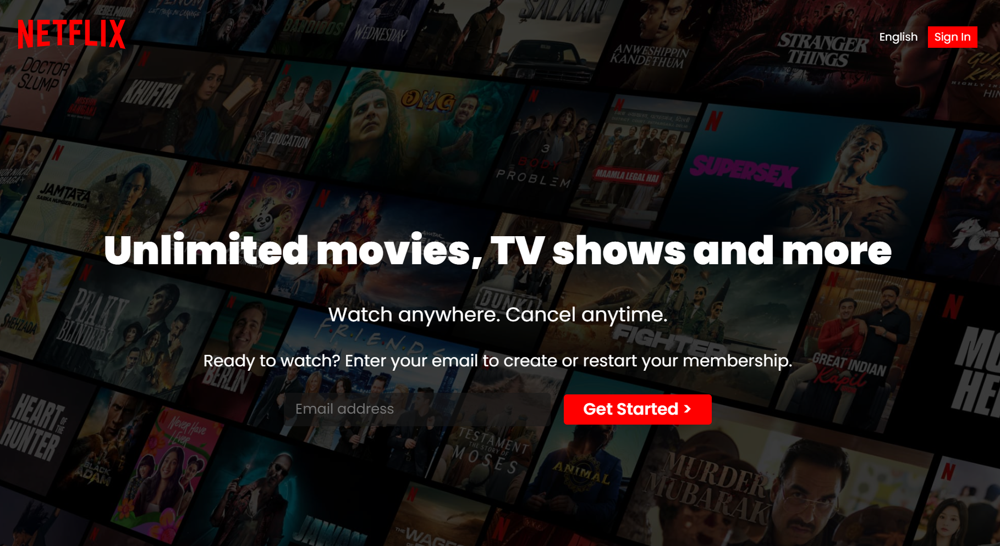

# Netflix Clone Using HTML And CSS

This is a Netflix Clone created using just HTML and CSS. The goal was to make a visually appealing clone website of Netflix. It uses HTML for structuring and CSS for design.

It is not a responsive one, so its fitted only for view of desktop